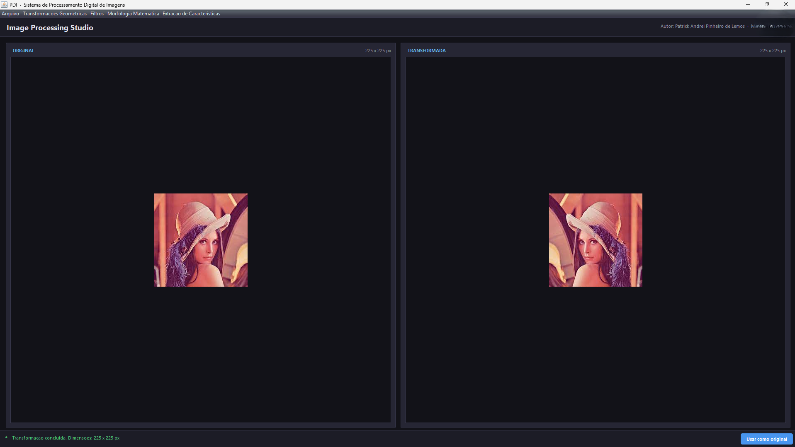

# Processamento Digital de Imagens - Image Processing Studio

Projeto desenvolvido na disciplina de Processamento Digital de Imagens
do curso de Ciência da Computação.

Aplicação desktop desenvolvida em Java para processamento digital de imagens.

## Demonstração

## Funcionalidades

- Abertura de imagens;
- Visualização da imagem original;
- Aplicação de transformações;
- Comparação entre imagem original e resultado;
- Histórico de alterações;
- Restauração da imagem original.

## Tecnologias

- Java
- Swing
- AWT
- BufferedImage
- ImageIO

## Como executar

1. Instale o Java.
2. Abra o projeto no VS Code ou Eclipse.
3. Execute a classe principal.

## Estrutura

src/
  ProcessamentoImagens.java
docs/
  tela-inicial.png
  comparacao-original-transformada.png
  aplicacao-filtro.png
  demontracao-historico.png

## Aprendizados

O projeto permitiu praticar interfaces gráficas com Swing, manipulação de imagens,
operações sobre pixels e organização de um fluxo de processamento visual.

## Status

Projeto acadêmico concluído.